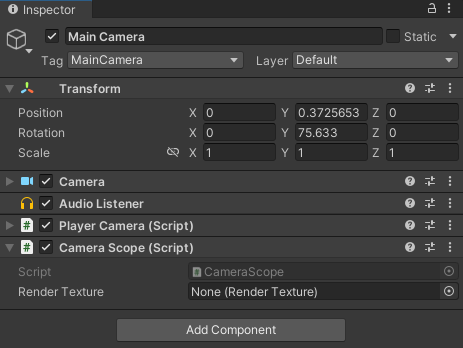
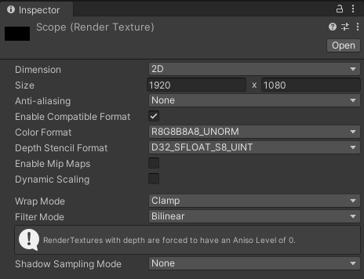
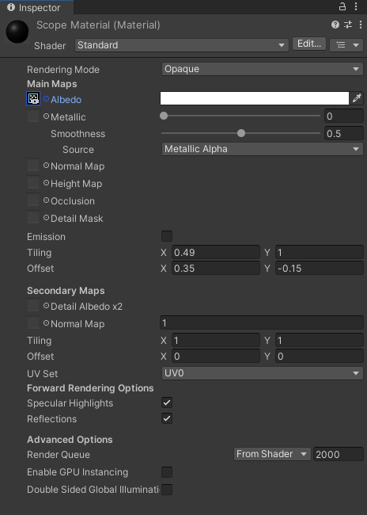
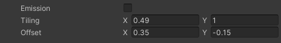

# Scope Tutorial for Unity

Welcome to the Scope Tutorial repository! In this tutorial, we will walk through how to create an efficient scoping system in Unity using a single camera. 

Traditionally, creating a scope effect in a game could involve using two cameras; one for the player's main view, and another for the scope. However, this approach can be resource-intensive. In this tutorial, we'll demonstrate how to achieve a similar effect more efficiently by rendering the camera's view to a texture and applying it to the scope lens.


## Implementation 

### Step 1: Setting Up the Project
Begin by creating a new 3D Unity project or use an existing one. Ensure you have a player character with a camera attached.

### Step 2: The CameraScope Script
Create a new C# script named `CameraScope` and attach it to the camera. Paste the following code into the script:

```csharp
using UnityEngine;

public class CameraScope : MonoBehaviour
{
    public RenderTexture renderTexture;

    void OnRenderImage(RenderTexture src, RenderTexture dest)
    {
        Graphics.Blit(src, renderTexture);
        Graphics.Blit(src, dest);
    }
}
```
This script takes the image rendered by the camera and copies it to a RenderTexture.



### Step 3: Assigning the RenderTexture
Create a new RenderTexture in your Assets (Right-click > Create > RenderTexture) and assign it to the `renderTexture` field in the CameraScope script on your camera.



### Step 4: Creating the Scope Material
Create a new material and assign the RenderTexture to it as well. This material will be used for the scope lens.



### Step 5: Adding a Zoom Effect
To create a zoomed-in effect when looking through the scope, we need to modify the material parameters. Change the material's Scale and Offset properties to zoom in on the texture. For example, set the Scale to `2, 2` for a 2x zoom.



Finally, assign the material to the lens on your scope in the 3D model.

## Example Unity Package 
You can also download the example Unity package that contains a fully functional example project with the scope system implemented. 

[Download Example Unity Package](./link_to_your_unity_package)

## Benefits of Using One Camera 📈
- **Performance**: Using one camera consumes less processing power, as rendering the scene twice can be resource-intensive, especially on lower-end hardware.
- **Simplicity**: It's easier to manage and troubleshoot issues with a single camera setup. The implementation is straightforward, making the development process more efficient.
- **Flexibility**: Modifying material parameters for zoom and other effects is much simpler than handling a second camera. This makes it easier to implement different types of scopes or visual effects.

## License 
This project is licensed under the [MIT License](./LICENSE).
